# The JC crater — a machine-propagated implication graph

On 2026-07-19 Levent Alpöge presented an explicit dim-3 counterexample to the
Jacobian Conjecture — *awaiting confirmation* (widely machine-verified within a
day, not yet peer-reviewed; see **Scope** below), with [our independent
certificate](../../certificates/jacobian-conjecture/) of the exhibited object.
Everything the crater derives is conditional on that counterexample.
JC was not an isolated statement: it sat at the center of the densest
implication network in affine algebraic geometry. When the center falls, the
*justified* status of every neighboring statement changes — but by **different
modalities** depending on how each is connected, and prose surveys reliably
botch exactly that distinction.

This directory is the falsification's blast radius as a **versioned,
machine-checked object**:

- [`implication_graph.json`](implication_graph.json) — nodes (each with a
  primary-source statement) and **typed edges** (each with a citation for the
  implication itself): `implies` / `equivalent`, crossed with
  `dimension_preserving` / `dimension_mixing`.
- [`computed_statuses.json`](computed_statuses.json) — **generated**: every
  node's status is derived by
  [`tools/validate_jc_crater.py`](../../tools/validate_jc_crater.py) from the
  certified root via modus tollens. Nothing is hand-asserted; the committed
  view is staleness-gated.
- [`padding_check.py`](padding_check.py) — the stabilization edge
  (FALSE at n=3 ⇒ FALSE for all n≥3, via F ↦ F × id) is **executed**, not
  cited: exact polynomial proof that the padded dim-4 map still has
  det ≡ −2 and still collides.
- [`geometric_degree.py`](geometric_degree.py) — likewise **executed**:
  exact certificate that `[C(x,y,z) : C(f1,f2,f3)] = 3`, i.e. the map is
  generically 3-to-1 (and, being étale, 3 honest points with no multiplicity).
  Upper bound from three Gröbner relations re-verified here as identities in
  `Q[x,y,z]`; lower bound from a specialization of the cubic that is
  irreducible by Gauss's lemma.
- [`quantities.json`](quantities.json) — the newborn bounded quantities the
  falsification minted (minimal counterexample dimension, minimal degree, …),
  with `evidence[]` and computed confidence classes, gap_map-style.

<!-- efa:crater-map:begin (generated by validate_jc_crater.py --write) -->

## The blast radius at a glance

*Generated from the ledger by `tools/validate_jc_crater.py --write`: all 37 nodes, every count, color, and edge below are computed from `implication_graph.json` + `computed_statuses.json` — never hand-drawn. Plus 8 candidate names that failed literature verification (quarantined, excluded).*

```text
✕ Refuted for all n ≥ 3             █████████████████ 13
⊘ Refuted in some finite dimension  ████████████████████ 15
○ Open                              ████ 3
✓ Survives (proven theorem)         ███████ 5
■ Refuted independently, pre-2026   █ 1

                                    37 sourced statements (+8 quarantined)
```

| | | Status | Count | What it means |
|:-:|:-:|:--|--:|:--|
| 🟥 | ✕ | **Refuted for all n ≥ 3** | 13 | false in every dimension n ≥ 3 (reached through a per-dimension edge) |
| 🟧 | ⊘ | **Refuted in some finite dimension** | 15 | false in at least one finite dimension, location unknown (a dimension-blowup reduction) |
| 🟦 | ○ | **Open** | 3 | untouched — the counterexample says nothing about it |
| 🟩 | ✓ | **Survives (proven theorem)** | 5 | a proven theorem, still standing |
| ⬜ | ■ | **Refuted independently, pre-2026** | 1 | already refuted before 2026, by a different mechanism |

```mermaid
flowchart RL
  dixmier_conjecture["✕ Dixmier Conjecture DC_n"]:::alln
  hom_dixmier_conjecture["✕ Hom-Dixmier Conjecture"]:::alln
  jacobian_conjecture[["☢ Jacobian Conjecture — THE ROOT"]]:::root
  jc_over_char0_fields_and_z["✕ Base-field / over-Z reduction of JC"]:::alln
  jc_tree_vanishing["✕ Tree-vanishing reformulation of JC"]:::alln
  jedrzejewicz_zielinski_jc_mnk["✕ Jedrzejewicz-Zielinski generalized Jacobian family JC"]:::alln
  keller_properness_universal["✕ Universal properness of Keller maps"]:::alln
  nowicki_commutative_basis["✕ Nowicki's commutative-basis characterization"]:::alln
  picard_vessiot_reformulation["✕ Picard-Vessiot / Wronskian reformulation"]:::alln
  poisson_conjecture["✕ Poisson Conjecture"]:::alln
  special_image_conjecture["✕ Special Image Conjecture SIC"]:::alln
  square_free_preserver["✕ Square-free-preserver reformulation"]:::alln
  tate_jacobian_conjecture["✕ Tate-Jacobian Conjecture TJC"]:::alln
  bisi_subtree_shuffle_markov_conjecture["⊘ Bisi et al. subtree-shuffling Markov-chain sufficient condition for JC"]:::somedim
  chamberland_conjecture["⊘ Chamberland Conjecture"]:::somedim
  char_p_strengthenings["⊘ Characteristic-p formulations implying char-0 JC"]:::somedim
  cubic_homogeneous_jc["⊘ JC for cubic homogeneous maps"]:::somedim
  druzkowski_jc["⊘ JC for Druzkowski maps"]:::somedim
  gaussian_moments_conjecture["⊘ Gaussian Moments Conjecture GMC"]:::somedim
  hessian_conjecture["⊘ Hessian Conjecture"]:::somedim
  image_conjecture["⊘ Zhao's Image Conjecture"]:::somedim
  integral_conjecture["⊘ Zhao's Integral Conjecture"]:::somedim
  jelonek_real_jc["⊘ Jelonek's Real Jacobian Conjecture"]:::somedim
  mathieu_conjecture["⊘ Mathieu Conjecture"]:::somedim
  symmetric_jc["⊘ JC for symmetric Keller maps"]:::somedim
  unimodular_conjecture["⊘ Unimodular Conjecture"]:::somedim
  vanishing_conjecture["⊘ Zhao's Vanishing Conjecture"]:::somedim
  yagzhev_engel_capelli["⊘ Yagzhev's algebraic formulation"]:::somedim
  kontsevich_conjecture_weyl["○ Kontsevich Conjecture"]:::open
  plane_jacobian_conjecture["○ Plane Jacobian Conjecture"]:::open
  symmetric_dependence_problem["○ Dependence problem for symmetric Jacobians"]:::open
  ax_grothendieck_theorem["✓ Ax-Grothendieck theorem"]:::theorem
  bcw_tree_formula["✓ Bass-Connell-Wright tree inversion formula"]:::theorem
  jc_dimension_padding["✓ Dimension stabilization of Keller counterexamples"]:::theorem
  wang_degree_two_theorem["✓ Wang's theorem"]:::theorem
  yu_nonnegative_theorem["✓ Yu's theorem"]:::theorem
  real_jc_nonvanishing["■ Strong real Jacobian conjecture"]:::indep
  dixmier_conjecture --> jacobian_conjecture
  jacobian_conjecture -.-> dixmier_conjecture
  cubic_homogeneous_jc -.-> jacobian_conjecture
  druzkowski_jc -.-> jacobian_conjecture
  mathieu_conjecture -.-> jacobian_conjecture
  image_conjecture -.-> jacobian_conjecture
  vanishing_conjecture -.-> jacobian_conjecture
  hessian_conjecture -.-> jacobian_conjecture
  jacobian_conjecture --> hessian_conjecture
  integral_conjecture -.-> jacobian_conjecture
  symmetric_jc -.-> jacobian_conjecture
  keller_properness_universal --> jacobian_conjecture
  jelonek_real_jc -.-> jacobian_conjecture
  chamberland_conjecture -.-> jacobian_conjecture
  yagzhev_engel_capelli -.-> jacobian_conjecture
  hom_dixmier_conjecture --> dixmier_conjecture
  char_p_strengthenings -.-> jacobian_conjecture
  tate_jacobian_conjecture --> jacobian_conjecture
  unimodular_conjecture -.-> jacobian_conjecture
  nowicki_commutative_basis --> jacobian_conjecture
  square_free_preserver --> jacobian_conjecture
  picard_vessiot_reformulation --> jacobian_conjecture
  jc_tree_vanishing --> jacobian_conjecture
  gaussian_moments_conjecture -.-> special_image_conjecture
  special_image_conjecture --> jacobian_conjecture
  poisson_conjecture --> dixmier_conjecture
  jc_over_char0_fields_and_z --> jacobian_conjecture
  jedrzejewicz_zielinski_jc_mnk --> jacobian_conjecture
  bisi_subtree_shuffle_markov_conjecture -.-> jacobian_conjecture
  subgraph legend [" "]
    direction LR
    LKEY["how to read the arrows — X to Y means X implies Y, so Y falling pulls X down"]:::legendnote
    LP1["any statement"]:::legendbox -->|"solid: per-dimension — full ∀ n ≥ 3 refutation flows"| LP2["Jacobian Conjecture"]:::legendbox
    LM1["any statement"]:::legendbox -.->|"dashed: dimension-MIXING — only the weaker some-finite-dim flows"| LM2["Jacobian Conjecture"]:::legendbox
  end
  classDef root fill:#450a0a,stroke:#000,color:#fff,stroke-width:4px;
  classDef legendbox fill:#f5f5f4,stroke:#78716c,color:#1c1917,stroke-dasharray:2 2;
  classDef legendnote fill:#fffbeb,stroke:#a16207,color:#1c1917;
  style legend fill:#fffbeb,stroke:#a16207;
  classDef alln fill:#991b1b,stroke:#450a0a,color:#fff;
  classDef somedim fill:#f59e0b,stroke:#92400e,color:#1c1917;
  classDef open fill:#1d4ed8,stroke:#1e3a8a,color:#fff;
  classDef theorem fill:#15803d,stroke:#14532d,color:#fff;
  classDef indep fill:#9ca3af,stroke:#4b5563,color:#1c1917;
```



**Reading the map.** Each node carries its status **glyph** as well as its colour, so the map survives greyscale, colour blindness, and being screenshotted away from this legend — colour is never the only signal. ☢ is the root (the certified counterexample); everything else is *computed* from it, never asserted. The lone 🟦 ○ node with no outward arrow — the **plane Jacobian Conjecture (n = 2)** — is the entire surviving frontier: nothing propagates down to it.

<!-- efa:crater-map:end -->

## The modality discipline (the point of the whole thing)

A statement `X` connected to JC dies in the way its edge type dictates, and in
no other way:

| edge to JC | JC now FALSE (all n ≥ 3) means | status vocabulary |
|---|---|---|
| `X implies JC`, dimension-preserving | X false for every n ≥ 3 | `REFUTED_ALL_N_GE_3` |
| `X implies JC`, dimension-mixing (reduction with dimension blowup) | X false **in at least one finite dimension**, location unknown | `REFUTED_SOME_FINITE_DIM` |
| `X equivalent to JC`, dimension-preserving | X false for every n ≥ 3 | `REFUTED_ALL_N_GE_3` |
| `JC implies X` | **nothing about X's truth** — its conditional support is void | `OPEN` + `orphaned_conditional_support` |
| no edge | untouched | `OPEN` |

For statements **not indexed by dimension** — Mathieu's conjecture (quantified
over compact Lie groups), the Unimodular conjecture (over primes) — read
`REFUTED_SOME_FINITE_DIM` as "fails for some finite value of the reduction
chain's parameter"; the node's own notes give the exact reading (e.g. "false
for at least one compact group"). The binary preserving/mixing model is
deliberately coarse: a `dimension_mixing` edge always yields the weak floor, and
any sharper per-parameter claim lives in the node notes as hand analysis, never
as a computed status.

If an edge chain ever derives a refutation for a node marked as a **proven
theorem**, the validator halts with `INCONSISTENCY` — that is not a status, it
is a proof that some edge's direction or semantics is wrongly recorded.

## Admission rules (anti-hallucination gate)

The candidate node list originated partly from LLM output. Therefore:

1. **No node without a primary source.** Every candidate was researched by an
   independent verification agent; candidates whose statements could not be
   sourced are stored with `verification: UNVERIFIED_CANDIDATE`, are **excluded
   from propagation**, and may not carry edges. They are kept visible — a
   confabulated conjecture list is itself a finding.
2. **No edge without a citation** for the implication itself (who proved it,
   where), plus an adversarial direction-check: a flipped implication poisons
   every downstream status, so each admitted edge was re-verified against its
   cited source by a second, hostile agent.
3. **Machine checks are executed.** The root certificate and the stabilization
   lift run on every validation; if either exits nonzero the graph is invalid.

## Replay

```
python3 tools/validate_jc_crater.py          # validate + drift-check (runs the machine checks)
python3 tools/validate_jc_crater.py --write  # regenerate computed_statuses.json
python3 -m pytest tests/test_jc_crater.py    # propagation-rule unit tests
```

## Scope, honestly

The graph records what the counterexample **justifies saying**, per edge, per
modality — nothing more. The counterexample itself is Alpöge's ("awaiting
confirmation": widely machine-verified, not yet peer-reviewed); the certificate
this graph roots in is ours; the statuses are computed. Where the literature
was ambiguous about an edge, the edge was left out — an absent edge understates
the blast radius, which is the safe direction to be wrong in.

## Root-claim freshness

All 30 computed statuses are conditional on **one** external fact: Alpöge's
2026-07-19 announcement, currently "awaiting confirmation." Nothing described
above watches for that status changing —
[`validate_jc_crater.py`](../../tools/validate_jc_crater.py) staleness-gates
the *generated view* against the *committed graph*, which says nothing about
whether the graph's root is still current literature.

[`tools/jc_root_tripwire.py`](../../tools/jc_root_tripwire.py) is that missing
instrument: it polls arXiv's public API for the paper itself (if it ever gets
an id — see [`root_claim.json`](root_claim.json)) and for new
Jacobian-Conjecture-related submissions, and flags title/abstract language
shaped like a retraction, erratum, refutation, or confirmation/publication
announcement.

```
python3 tools/jc_root_tripwire.py            # poll once; exit 0 unless a NEW hit
python3 tools/jc_root_tripwire.py --dry-run  # poll and print, write no state
```

**Keep the distinction crisp.** This tripwire watches the **claim** (who gets
credit, whether/when it's peer-reviewed) — never the **object**.
[`certificates/jacobian-conjecture/verify.py`](../../certificates/jacobian-conjecture/verify.py)
independently re-derives that the exhibited map has a constant nonzero
Jacobian and collides three named points every time it is run; a retraction of
the *announcement* does not un-verify that arithmetic fact about that map. It
would change every status in this directory pending human review, which is
exactly what the tripwire is for.

**Honest limits — read before trusting a clean run.** This is a keyword
tripwire over arXiv abstracts, nothing more. Keyword classes alone false-positive
freely — a 2022 paper on plane-JC degree bounds tripped
`confirmation_or_publication` purely on the word "confirm" — so an item only
alerts if its latest version postdates the announcement, on the grounds that
nothing published before 2026-07-19 can be a retraction or confirmation *of*
2026-07-19. That gate removes a whole class of noise and removes no detection
the tripwire ever had; it does not make the remaining matches verdicts. More
importantly, this **cannot prove the absence** of a retraction — a correction
posted anywhere arXiv doesn't index (social media, a journal editorial, a
Wikipedia talk page) is invisible to it, and silence from this script is not
evidence the claim still stands. A clean run is a prompt to keep trusting the
status quo, not a verdict; a flagged run is a prompt for a human to read the
listed items and decide, not an automatic correction. See the tool's own
docstring for the full statement of limits.

## What a confirmation triggers — the archival policy

A signal is only useful if something is attached to it, so one standing action
is written down in [`root_claim.json`](root_claim.json) under
`archival_policy` (decided 2026-07-20):

**While the root claim is "awaiting confirmation", no crater artifact gets a
DOI.** Not the JC verification, not this graph, not the explicit Dixmier
object. A DOI is permanent — a Zenodo record can be versioned but never
retracted — and *everything here is conditional on an external, unrefereed
announcement*. Minting now would permanently timestamp this project's name
against a claim whose truth-value is held by someone else. A DOI is also the
most discovery-shaped signal available, and the contribution here is typed as
independent **verification** plus derived corollaries; a record titled
"Dixmier Conjecture" would be read by title-only readers as a claim
[`certificates/dixmier-conjecture/`](../../certificates/dixmier-conjecture/)
explicitly declines to make. And what a DOI would buy — a public timestamp,
hash-pinned permanence — git already supplies.

**If the claim is confirmed** (arXiv preprint, peer review, or settled
community acceptance on the tracked Wikipedia article): mint **one** combined
DOI for the whole package — the JC object verification, this graph, and the
Dixmier object — whose subject is *our* verification work, with Alpöge's
construction cited as the input, never claimed. One record, not one per
corollary. The mint is a human-of-record act.

**If the claim is retracted:** mint nothing. Nothing was lost by waiting, and
that asymmetry is the entire argument.
