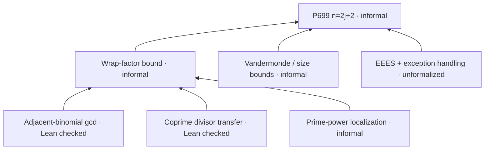

# A kernel-checked arithmetic seed for P699

This is a small formal component, **not a formalization of Erdős #699**, not a novelty claim, and not a proof of the second sortie's complete diagonal results. It is isolated from the production graph and frozen certificates.

## Exact result

For **every** `j k : Nat`, with no hypotheses:

\[
(k+1)\gcd\!\left(\binom jk,\binom{j+1}{k+1}\right)
=\binom jk\,\gcd(k+1,j+1).
\]

[`AdjacentBinomialGcd.lean`](AdjacentBinomialGcd.lean) uses the standard `Nat.choose` and `Nat.gcd`. It proves the general homogeneous identity `a*c=b*d → a*gcd(b,c)=b*gcd(a,d)` and specializes via `Nat.add_one_mul_choose_eq`.

It also proves the exact divisor transfer:

```text
U | B, gcd(U,A)=1, A*C=(j+1)*B  ==>  U | C.
```

For the [informal P699 argument](../astra-briefcase-20260904/699/result.md), set `k=A-1` with `A>=1`. Our multiplication-form identity avoids natural-number division entirely. Recovering the displayed rational quotient and the later inequality is a further, currently unformalized step.

## The trust boundary

- Separate files check the full requested types: [`ExactStatement.lean`](ExactStatement.lean), [`DivisorTransferCheck.lean`](DivisorTransferCheck.lean).
- [`AxiomAudit.lean`](AxiomAudit.lean) uses `#guard_msgs` to make the build fail unless all three declarations report exactly `[propext, Quot.sound]`. No `sorryAx`, custom axiom or classical choice occurs in these declarations' reported axiom dependencies.
- No `sorry`, `native_decide`, or unsafe proof discharge is used. The isolated [negative control](negative/AlteredIdentity.lean) changes the right-hand gcd to 1 at `j=3,k=1`; ordinary `decide` rejects the resulting false equality. It is intentionally outside the default build.
- This is normal Lean kernel checking against imported pinned libraries. **No independent second-kernel replay or fresh rechecking of all cached dependencies is claimed.**

## Replay

Install Lean **v4.33.1**, then run from this directory:

```sh
# Materialize the versions recorded in lake-manifest.json and fetch only
# the transitive cache needed by this import, not the entire Mathlib cache.
lake exe cache get Mathlib.Data.Nat.Choose.Basic
lake build
lake env lean ExactStatement.lean
lake env lean DivisorTransferCheck.lean
lake env lean AxiomAudit.lean
# Expected exit 1 with “is false”, not an import or syntax failure:
lake env lean negative/AlteredIdentity.lean
```

`lake build` includes both exact statement checks, the axiom audit, and the library/witness checks. Do not treat the intentional negative file's failure as a positive proof.

An [independent source and statement audit](review/REVIEW.md) passed and rebuilt the seed in a separate workspace. Its root-qualified contracts and axiom-contamination control were also replayed against the packaged project:

```sh
lake env lean review/FullyQualified.lean
# Expected exit 1 specifically for the axiom-list mismatch:
lake env lean review/PoisonedGuard.lean
```

The latter deliberately introduces a custom axiom into an isolated test theorem. It never enters the successful default targets; the guard correctly rejects the extra dependency. The two negative controls test different failures: a false equation versus an unauthorized axiom.

For an atlas working checkout, keep `.lake` outside the repository (for example, create a fresh external directory and symlink `.lake` to it before setup). The repository's privacy test scans even ignored generated files, and Lean's generated traces contain local paths. No build-cache symlink or binary is committed. The complete repository suite passed after moving the local generated cache out of the checkout: **148 passed, 2 skipped**.

### Pins

- Lean `v4.33.1`, commit `819816b2e0a3bf405af45ae5c7af2491d8f5bee6`.
- Mathlib `v4.33.1`, commit `0df444a360eaa60ab8c11dca51a86af692955474`, specified as an immutable git dependency rather than a machine-local path.
- All transitive git dependencies are pinned in `lake-manifest.json`; each local dependency checkout was checked against that lockfile. The setup-generated lock was adapted from a path dependency to the immutable Mathlib git pin and accepted by the packaged build. Two attempts at `lake update` timed out, so a clean dependency-resolution/bootstrap run is **not** claimed.
- [Execution receipt](execution.json) and [build log](logs/build.txt) preserve the successful packaged checks; replay commands verify the mathematics afresh rather than trusting those logs.
- Lean's [published kernel-bug postmortem](https://leodemoura.github.io/blog/2026-8-24-postmortem-for-the-kernel-soundness-bug-hunt/) identifies v4.33.1 as including the reported fixes. This is not a guarantee against unknown bugs.

Local setup used the official arm64 macOS release. Its archive SHA-256 was checked against the [official release metadata](https://api.github.com/repos/leanprover/lean4/releases/tags/v4.33.1): `88c45aad985b5d2a8d925fe10bd1296bd35f66f408480ab182d3facccd065a9d`. Binaries and dependency caches are not committed. Local proof targets were rebuilt in this directory while reusing the setup's dependency binaries. Replay therefore does not claim a network-clean bootstrap on another OS.

## Where this sits in the proof graph

The [obligation ledger](proof-obligations.json) records only a small dependency roadmap. Its statuses are explicit metadata, **not an automatic theorem prover or a complete machine-extracted proof DAG**.



The new proofs discharge the two small arithmetic nodes—not the EEES theorem, localization, wrap classification, inequalities, exception audit, or final P699 theorem. No axiom standing in for EEES is introduced into Lean.
