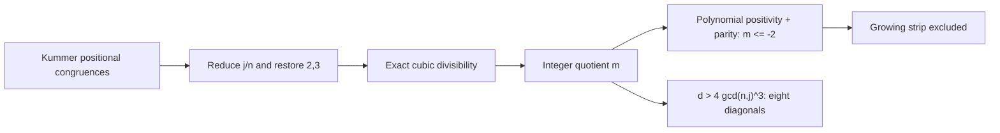

# From connection graph to proofs and obstructions

This sprint follows the [133-edge connection analysis](../CONNECTIONS.md).
It produced an elementary arithmetic exclusion, a reusable Lean-checked
transport theorem, and a quantitative countermodel to a tempting inference.
The arithmetic and countermodel results do not assume OpenAI's new theorems.
No canonical status or frozen certificate is changed. Literature novelty is
unverified; “new” below means a derivation added to this checkout.

## 1. P699: an infinite exclusion, not a larger row sweep

The [arithmetic proof](arithmetic/README.md) establishes that any remaining
counterexample in the i=3, 4-divides-n branch, with d=n−2j>=4, must satisfy

    d^3 >= 2 n^2 + (d-2)(3n-2) > 2 n^2.

Thus the near-central band `(n-2j)^3 <= 2n^2` is excluded. The already established
odd-n and n=2 mod4 branches, together with the separately handled d=0,2 cases,
connect this to the full i=3 question in that band. It does not settle all i=3
or the full problem.

A second consequence proves **eight infinite families**: for every j>3 and
`d in {4,8,12,16,20,24,28,32}`, some odd prime divides both `binomial(2j+d,3)`
and `binomial(2j+d,j)`. These statements have no upper bound on j.

The decisive step is to keep an exact integer quotient. Put j/n=u/v in lowest
terms. The positional congruences from Kummer imply

    (n-1)(n-2) | u(v-u)(v-2u).

The proof restores the omitted factors 2 and 3. If the quotient is k and
g=gcd(n,j), the integer m=4g^3 k-d satisfies

    m(n-1)(n-2) = d(3n-d^2-2).

A positive-polynomial identity excludes m>0, parity excludes m=0, and then
m is a negative even integer, hence at most -2. That discrete jump produces
the stronger strip. For 4|d it jumps in multiples of four; moreover m<0
forces d>4g^3, excluding d<=32 in that residue class.



Two agents independently reviewed the arithmetic reduction. The complete
number-theoretic proof is informal. The final seven-diagonal polynomial
contradictions are separately checked in
[DiagonalInequality.lean](arithmetic-checks/DiagonalInequality.lean); the growing
strip's algebraic core has ten audited declarations in
[CubicStrip.lean](density-transport/CubicStrip.lean), including the positivity
identity, parity and coefficient-two conclusion. Those
formal implications do not by themselves formalize Kummer localization or the
prime-power reduction.

The [exact finite verifier](arithmetic/verify.py) checks 39,988 binomial pairs,
13,161 individual localization implications, 140,625 positional pairs, and
3,976 direct diagonal examples. It also checks 377 cubic-divisibility passes,
including nontrivial passes that fail the stronger positional conditions.
These controls keep “necessary condition” separate from “counterexample.”
The infinite claims rest on the proof rather than these finite checks.

## 2. P841: the joint-law bridge is now Lean-checked

[DensityTransport.lean](density-transport/DensityTransport.lean) proves the
reusable inference behind the waiting-time application, without assuming any
OpenAI theorem. On a finite observation list,

    discrepancy(A,B) <= 2 leakage(A outside B) + positive marginal excess(B,A).

Replacing a fixed finite list of coordinates changes any Boolean joint event
on at most the sum of their discrepancies. The proof then derives the o(n)
version, including triangular arrays of events: sublinear one-sided leakage
and marginal excess imply sublinear change in every fixed finite-coordinate
joint-event count.

Thirteen named declarations were compiled under official Lean 4.33.1, with
standard logical axioms only. Both intentionally false controls, obtained by
dropping a hypothesis, are rejected. The square-product waiting-time comparison,
its density-zero exceptional set, the published marginal theorem and the new
Dickman input remain separate application obligations.

## 3. P969: strong pair cancellation still does not control growing windows

The [correlation barrier](correlation-barrier/README.md) proves existence of a
bounded sequence with any prescribed limiting mean square c in (0,1], such that
all fixed nonproportional affine-pair correlations have savings of every fixed
logarithmic power. Even the shift estimates are uniform for 1<=h<=X.
Nevertheless, for **every** fixed theta in (0,1), its average H-window energy
divided by H is unbounded along a subsequence when H=floor(X^theta).

The construction uses a random background and sparse intervals of ones of
length N*exp(-constant*sqrt(log N)). Their density decays faster than every
logarithmic power, yet each eventually contains polynomial-length windows.
The construction and all quantifiers received an independent model review.
It is not a multiplicative sequence or a counterexample about Mobius itself.
It shows that the correlation estimates alone cannot justify that inference.

The [finite exact illustration](correlation-barrier/receipt.json), reconstructed
from a fixed hash recipe, has normalized energy about 30.73 at X=131,072,
H=1,024; the planted interval alone gives a lower bound above 24. The finite
checker proves only those measurements, not the probabilistic infinite theorem.

## 4. F003: source tracing improved; proof acceptance did not change

The [source audit](source-audit/README.md) follows the Comparator configuration
into the actual solution theorem, final assembly, certified-band argument,
Hecke zero supremum and connection with Mathlib's Dirichlet L-function.
No immediate exported analytic assumption or function-definition mismatch was
found in that inspected chain.

A bounded read-only scan covers 2,000 OAI modules, about 20 MB, with 84 modules
still on its frontier. The scanned prefix has no flagged axiom/sorry/unsafe
source tokens. This is a lexical observation, not a kernel audit.

The executable Lake configuration also applies compatibility patches to 23
dependencies. Patch contents and external dependency modules were not audited.
The source requires Lean 4.34.1; our own small proofs use 4.33.1. No F003 proof
build or Comparator run was performed. Its graph consequences stay conditional.

## Replays and evidence boundaries

```sh
python3 -I experiments/openai-math-20261006/research-sprint/arithmetic/verify.py
python3 experiments/openai-math-20261006/research-sprint/correlation-barrier/finite_probe.py --check experiments/openai-math-20261006/research-sprint/correlation-barrier/receipt.json
python3 experiments/openai-math-20261006/research-sprint/density-transport/verify.py --lean /path/to/lean-4.33.1/bin/lean
python3 experiments/openai-math-20261006/research-sprint/arithmetic-checks/verify.py --lean /path/to/lean-4.33.1/bin/lean
python3 experiments/openai-math-20261006/research-sprint/density-transport/verify_cubic_strip.py --lean /path/to/lean-4.33.1/bin/lean
```

The Lean toolchain download and build outputs stay outside tracked source (or
in ignored local build directories). Receipts pin the official archive and
source hashes. Replays run the compiler and reject the negative controls;
the receipts themselves are not substitutes for executing those checks.

[results.json](results.json) names the atlas nodes, exact scope and evidence paths.
The natural next formalization target is the Kummer-to-reduced-cubic implication;
that is the remaining gap between the reviewed full arithmetic argument and a
kernel-checked P699 subcase theorem.

Validation for this sprint: `uv run --python 3.11 --with-requirements
requirements-dev.lock make audit-fast` passed, including graph/status checks,
certificate replays, and **260 tests passed, 2 skipped**. Separate local replays
passed for the arithmetic checks, the exact correlation illustration, 13 density
transport declarations, ten cubic-strip declarations and three diagonal algebra
declarations. The two density negative controls and false d=32 polynomial
extension were rejected. The cubic module also proves a concrete control
showing why its nonzero premise cannot be dropped. Result-receipt hashes and
local Markdown links were checked.
